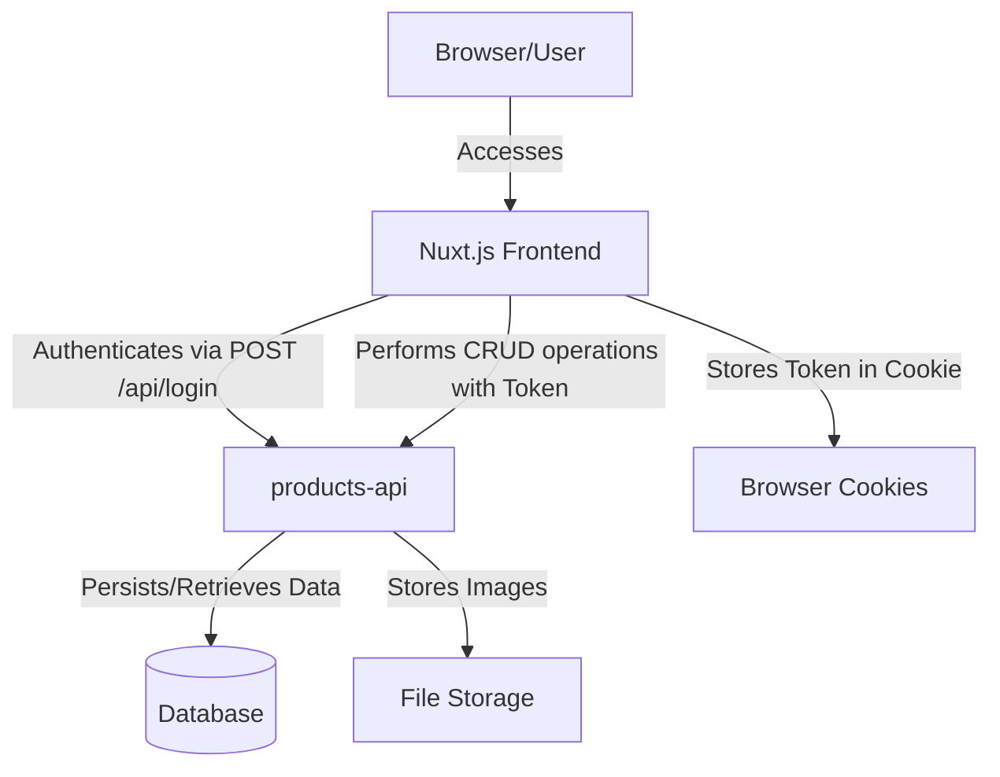

# Product Management Dashboard

## Overview

This project is a client-side rendered web application built with Nuxt.js (Vue.js framework) designed for the administration and management of products. It provides a user-friendly interface for authenticated users to perform CRUD (Create, Read, Update, Delete) operations on product data, including managing product images. The application interacts with a separate backend API (`products-api`) to persist and retrieve data.

## Key Technologies

*   **Vue.js:** The progressive JavaScript framework for building user interfaces.
*   **Nuxt.js:** A powerful framework for Vue.js that enables client-side rendering, routing, and project structure.
*   **Bootstrap-Vue:** Integration of Bootstrap components with Vue.js for responsive and consistent UI.
*   **Axios:** A promise-based HTTP client for making API requests to the backend.
*   **js-cookie:** A simple, lightweight JavaScript API for handling browser cookies, used here for authentication token management.

## Architecture

### Frontend (Client-Side)

The application is configured for **Client-Side Rendering (CSR)** (`ssr: false` in `nuxt.config.js`). This means the browser receives a minimal HTML page and then renders the Vue.js application entirely on the client.

*   **Component-Based Structure:** The UI is composed of reusable Vue components (e.g., `SideBar`, `Toast`).
*   **Page-Based Routing:** Nuxt.js handles routing based on the `pages/` directory structure (e.g., `pages/index.vue` for product listing, `pages/login.vue` for authentication).
*   **Direct API Interaction:** Components directly interact with the backend API using Axios for data fetching and manipulation.
*   **Local State Management:** State is primarily managed within individual components, with `js-cookie` handling authentication tokens.

### Backend (External Dependency)

This frontend application relies on a separate `products-api` backend service (expected to be running on `http://127.0.0.1:8000`). This API is responsible for:

*   User authentication (login).
*   Product data persistence (CRUD operations).
*   Image storage and retrieval.

### High-Level System Diagram



## Features

*   **User Authentication:** Secure login process with token-based authentication.
*   **Product Listing:** View a paginated list of all products.
*   **Product Management:**
    *   **Create:** Add new products with details (name, price, ISBN, description) and up to 5 images.
    *   **Edit:** Update existing product details and images.
    *   **Delete:** Remove products from the system.
*   **Image Upload:** Upload multiple images per product (up to 5, max 5MB per image, supported formats: PNG, JPG, JPEG).
*   **Responsive UI:** Built with Bootstrap-Vue for a consistent experience across devices.
*   **Toast Notifications:** User feedback for successful operations or errors.

## Installation and Setup

To get this project up and running, follow these steps:

1.  **Clone the repository:**
    ```bash
    git clone https://github.com/MatheusConstantino/products-management.git
    cd products-management
    ```

2.  **Install dependencies:**
    ```bash
    npm install
    ```

3.  **Start the development server:**
    ```bash
    npm run dev
    ```
    The application will be accessible at `http://localhost:3000`.

**Important Note:** This application requires the `products-api` backend to be running on `http://127.0.0.1:8000` for full functionality. Ensure the backend is operational before starting the frontend.

## Tradeoffs and Considerations

*   **Client-Side Rendering (CSR):**
    *   **Pros:** Simpler deployment, faster initial load for small applications, good for highly interactive dashboards.
    *   **Cons:** Slower initial page load for content-heavy applications (due to JavaScript bundle download and execution), less SEO-friendly (though Nuxt.js offers SSR options), potential for blank page until JS loads.
*   **Direct Component API Calls:**
    *   **Pros:** Quick to implement for smaller projects, clear data flow within a component.
    *   **Cons:** Can lead to duplicated logic, harder to manage global state, less maintainable in larger applications.
*   **Local State Management:**
    *   **Pros:** Simple for isolated component states.
    *   **Cons:** Can become complex to share state between components, harder to debug state changes across the application. A centralized store (like Vuex) would be beneficial for larger applications.
*   **Image Management:**
    *   **Current:** Direct upload to API, limited to 5 images per product, no image deletion functionality from the frontend (only replacement).
    *   **Considerations:** Implementing image deletion, optimizing image sizes, using a dedicated image CDN for production.

## Future Enhancements and Next Steps

1.  **Implement Server-Side Rendering (SSR):** Explore Nuxt.js SSR capabilities to improve initial load performance and SEO.
2.  **Centralized State Management (Vuex):** Introduce Vuex to manage application-wide state, especially for user authentication status, global loading indicators, and product data, to improve maintainability and scalability.
3.  **Enhanced Error Handling:** Implement more robust and user-friendly error handling mechanisms, including global error boundaries and specific error messages for API failures.
4.  **Image Deletion Functionality:** Add the ability to remove individual images from a product during the edit process.
5.  **Input Validation:** Implement comprehensive client-side and server-side input validation for product creation and editing forms.
6.  **User Roles and Permissions:** Extend authentication to include different user roles and restrict access to certain functionalities based on permissions.
7.  **Unit and Integration Tests:** Add automated tests for components, API interactions, and critical business logic to ensure reliability and prevent regressions.
8.  **CI/CD Pipeline:** Set up a Continuous Integration/Continuous Deployment pipeline for automated testing and deployment.
9.  **Dockerization:** Containerize both the frontend and backend applications for easier deployment and scalability.
10. **Improved UI/UX:** Refine the user interface and experience, potentially by introducing more advanced filtering, sorting, and search capabilities for products.
